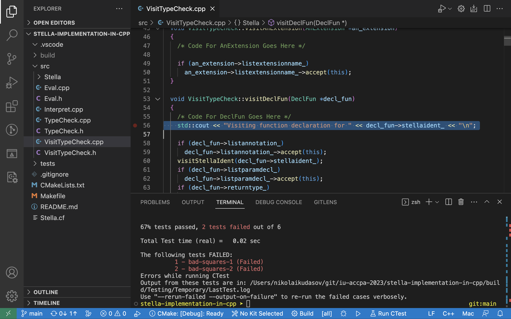

# Stella implementation in C++ (template)

This is the skeleton for a C++ implementation of the Stella programming language interpreter.



### Requirements

This was tested with:

* make 4.1
* BNFC 2.9.4.1
* flex 2.6.4
* bison 3.8.2
* g++ 11.2.0
* cmake 3.23.0-rc5
* ninja 1.8.2

### Building and running the interpreter

1. To build the interpreter run:

```sh
make
```

This typically involves running BNFC converter, and compiling the project in the chosen language,
resulting in an executable `build/stella-interpreter` that you can now use to type check and interpret programs.

2. Now, to run the type checker:

```sh
make typecheck
```

This starts the type checker waiting to input the program. Note that it will accept input until it encounters the end of file (Ctrl+D).

3. To run the interpreter:

```sh
make interpret <filename>
```

This starts the interpreter reading the program from the input file and waiting for the input of the argument for the _main_ function.

4. To run tests:

```sh
make test
```

This will run the tests specified in [`CMakeLists.txt`](CMakeLists.txt).

### Code Structure

[Interpret.cpp](src/Interpret.cpp) is the main file that contains the logic for reading a program and its arguments (if you run an interpreter).

[`TypeCheck.h`](src/TypeCheck.h) and [`TypeCheck.cpp`](src/TypeCheck.cpp) files assume the content of the type checker logic. Currently they contain only prototypes of the functions for further implementation.
The input program from the interpreter is passed directly to the `typecheckProgram` function.

[`Eval.h`](src/Eval.cpp) and [`Eval.cpp`](src/Eval.cpp) files similarly imply the logic of interpreting the program. They also contain only prototypes. The input program (read from the file) and the argument (entered after the interpreter starts) are passed directly to the `evalMainWith` function.

### How to develop

You must extend the existing files to perform the required actions.
If you need to add additional files, don't forget to add them to the [CMake file](CMakeLists.txt) (in the SRCS variable) to include them in the build process. 
